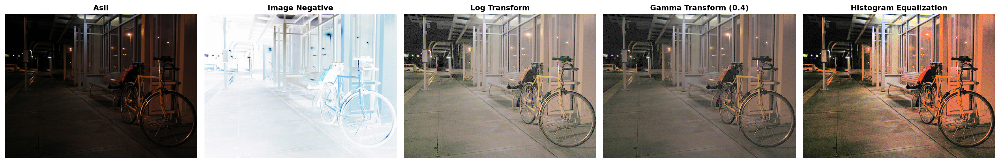
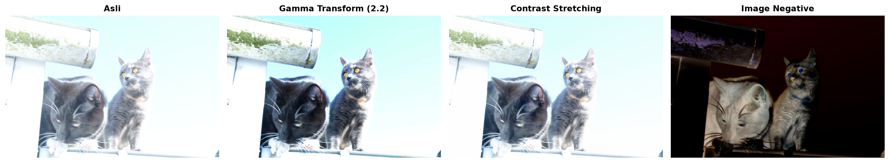
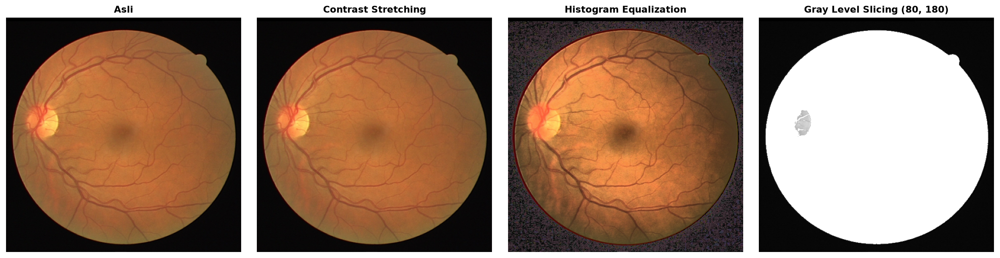
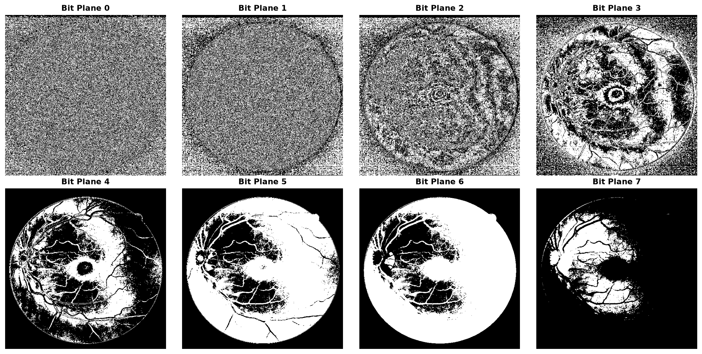
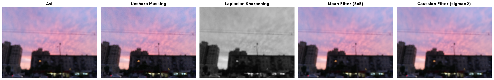
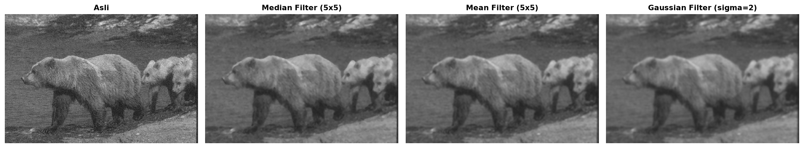

# PCD Assignment 02: Image Enhancement

* **Nama:** Muhammad Gauza Faliha
* **NIM:** 25/555851/PA/23315
* **Prodi:** Ilmu Komputer
* **Mata Kuliah:** Pengolahan Citra Digital
* **Repositori:** [tugas2pcd](https://github.com/gauzamf22/tugas2pcd)
* **Berkas Notebook:** `PCD_Assignment02.ipynb`

## Struktur Dataset

```
images/
├── blur/
│   └── blur.jpg
├── low-light-image/
│   └── low-light-image.png
├── low-contrast/
│   └── low-contrast.png
├── noisy/
│   └── noisy.jpg
└── over-exposed/
    └── over-exposured.jpg
```

## Hasil Perbandingan Visual (Before vs After)

### 1. Kategori Low Light Image
Perbandingan citra asli dengan Image Negative, Log Transform, Gamma Transform (0.4), dan Histogram Equalization:


### 2. Kategori Over Exposed
Perbandingan citra asli dengan Gamma Transform (2.2), Contrast Stretching, dan Image Negative:


### 3. Kategori Low Contrast
Perbandingan citra asli dengan Contrast Stretching, Histogram Equalization, dan Gray Level Slicing (80, 180):


Dekomposisi Bit Plane Slicing (Bit Plane 0 hingga 7):


### 4. Kategori Blur
Perbandingan citra asli dengan Unsharp Masking, Laplacian Sharpening, Mean Filter (5x5), dan Gaussian Filter (sigma=2):


### 5. Kategori Noisy
Perbandingan citra asli dengan Median Filter (5x5), Mean Filter (5x5), dan Gaussian Filter (sigma=2):


## Cara Menjalankan Notebook

Pastikan library Python sudah terpasang:
```bash
pip install numpy opencv-python matplotlib
```

Kemudain buka dan jalankan seluruh sel pada berkas `PCD_Assignment02.ipynb`:
```bash
jupyter notebook PCD_Assignment02.ipynb
```
